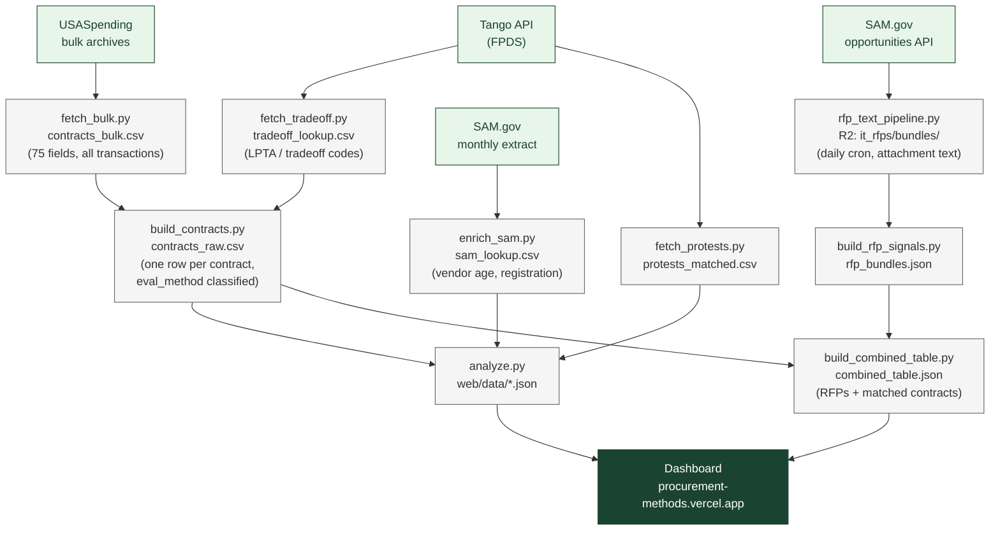

# How the Federal Government Buys IT Services

An open analysis of federal IT procurement methods — how contracts for custom
software and systems design are competed, evaluated, and awarded.

**[View the dashboard](https://procurement-methods.vercel.app)** |
**[View the data pipeline](#how-it-works)**

## What this is

This project pulls federal contract data from two public sources and classifies
every IT services contract by how it was evaluated:

- **LPTA** (Lowest Price Technically Acceptable)
- **Best-Value Tradeoff**
- **Fair Opportunity** (IDIQ/GWAC task orders)
- **Negotiated Proposal** (full and open competition)
- **Simplified Acquisition**
- **Sole Source**

The current dataset covers **NAICS 541511** (Custom Computer Programming) and
**541512** (Computer Systems Design) — the two codes most directly associated
with software development work. Excluded: 541513 (IT ops/managed services) and
541519 (too broad).

## What's in the dashboard

- How IT contracts are evaluated (by dollars and by count)
- How the mix has changed over time (FY2022–present)
- Vendor age distribution (from SAM.gov entity data)
- Which agencies use which methods
- Top vendors by obligated dollars
- GAO bid protests matched to IT solicitations
- Browsable RFP table: filter and search SAM.gov solicitations, view matched contracts, and read extracted attachment text
- Full methodology with classification rules and data sources

## How it works

### Contracts pipeline

```
fetch_bulk.py           USASpending bulk archives → data/contracts_bulk.csv
                        (contract details: dollars, agencies, vendors, competition fields)

fetch_tradeoff.py       Tango API (FPDS) → data/tradeoff_lookup.csv
                        (LPTA vs. best-value tradeoff codes — not in USASpending)

build_contracts.py      Join bulk + tradeoff → data/contracts_raw.csv
                        (classifies each contract into an eval_method)

enrich_sam.py           SAM.gov monthly extract → data/sam_lookup.csv
                        (vendor age, registration date)

fetch_protests.py       Tango API → data/protests_matched.csv
                        (GAO bid protests matched to IT solicitations)

analyze.py              contracts_raw + SAM + protests → web/data/*.json
                        (dashboard data files)
```

### RFP browser pipeline

```
rfp_text_pipeline.py    Daily cron: SAM.gov RFP attachments → R2 (it_rfps/bundles/)
                        (extracts text via pypdf/python-docx/openpyxl, runs label classifier)

fetch_solicitations.py  SAM.gov opportunity CSVs → data/solicitations/filtered.csv
                        (filters to target NAICS codes)

build_rfp_signals.py    R2 bundles + signals → web/data/rfp_signals.json + rfp_bundles.json
                        (aggregates label stats for the dashboard cards)

build_combined_table.py rfp_bundles + contracts_raw → web/data/combined_table.json
                        (joins solicitations to matched contracts by solicitation number)
```

## Quick start

```bash
# Install dependencies
pip install -r requirements.txt

# Set up API keys in .env
echo "TANGO_API_KEY=your_key" >> .env
echo "SAM_API_KEY=your_key" >> .env

# Contracts pipeline
python3 fetch_bulk.py --fy 2026          # start with one year (no API key needed)
python3 fetch_tradeoff.py                # LPTA/tradeoff codes (rate-limited, run daily)
python3 build_contracts.py               # join and classify
python3 enrich_sam.py                    # optional: vendor age from SAM
python3 fetch_protests.py               # optional: GAO protests
python3 analyze.py                       # build dashboard data

# RFP browser pipeline (requires R2 credentials for rfp_text_pipeline.py)
python3 build_rfp_signals.py             # pull bundles from R2, build rfp_bundles.json
python3 build_combined_table.py          # join RFPs to matched contracts

# View locally
cd web && python3 -m http.server 8000
```

All scripts are checkpoint/resume safe. If they get rate-limited or interrupted,
just re-run and they'll pick up where they left off.

## Methodology

### Pipeline diagram



### Where each field comes from

| Field | Derived in | Source data |
|-------|-----------|-------------|
| `eval_method` | `build_contracts.py` | Tango tradeoff code (priority) + USASpending competition fields |
| `tradeoff_code` | `build_contracts.py` | Tango API — LPTA / TO / O / null; blank for ~40–60% of awards |
| `obligated` | `build_contracts.py` | USASpending `total_dollars_obligated` — latest transaction (cumulative) |
| `contract_type` | `build_contracts.py` | USASpending `type_of_contract_pricing_code` — J=FFP, Y=T&M, Z=Labor Hours |
| `set_aside` | `build_contracts.py` | USASpending `type_of_set_aside_code` |
| `vendor_age_years` | `analyze.py` | SAM.gov `entity_start_date` → `award_date − entity_start_date` |
| `is_new_entrant` | `analyze.py` | SAM.gov `sam_registration_date` → award within 365 days of registration |
| `is_sba_small` | `analyze.py` | SAM.gov `sba_business_types` — non-empty = certified small |
| RFP label chips | `rfp_text_pipeline.py` | Regex classifier on extracted attachment text |
| Matched contracts | `build_combined_table.py` | Joined on `solicitation_number` = `solicitation_id` |

### Evaluation fields

Two separate fields — kept distinct because they come from different sources with different coverage.

**`eval_method`** — always populated, from USASpending competition fields:

| Category | Rule |
|----------|------|
| **Fair Opportunity** | `solicitation_procedures_code = "MAFO"` |
| **Negotiated Proposal** | `extent_competed` in (A, D) and `solicitation_procedures = "NP"` |
| **Simplified Acquisition** | `extent_competed` in (F, G) |
| **Sole Source** | `solicitation_procedures = "SSS"` |
| **Not Competed** | `extent_competed` in (B, C), not sole source |

**`tradeoff_code`** — partial coverage, from Tango API (FPDS `tradeoff_process`):

| Value | Meaning |
|-------|---------|
| `LPTA` | Lowest Price Technically Acceptable |
| `TO` | Best-Value Tradeoff |
| `O` | Other |
| null | Not yet fetched or not reported (~40–60% of awards) |

### Caveats

- **Tradeoff code coverage is partial.** FPDS `tradeoff_process` is contractor-reported and blank for ~40–60% of awards. Only ~5% of contracts currently have matched Tango codes — coverage grows daily as `fetch_tradeoff.py` runs via GitHub Actions (100 calls/day free tier).
- **USASpending is transaction-level.** We aggregate to one row per contract, taking the latest modification for categorical fields. If a contract's competition method changed across modifications, only the latest is reflected.
- **SAM entity data is self-reported.** Employee counts and dates may be blank or inaccurate.
- **RFP–contract matching is by solicitation number.** Coverage grows as the text pipeline backfill runs.

## Data sources

| Source | What it provides | Access |
|--------|-----------------|--------|
| [USASpending](https://www.usaspending.gov) bulk archives | Contract details (75 fields per transaction) | Free, no key needed |
| [Tango API](https://govcon.dev) (FPDS) | LPTA/tradeoff evaluation codes, GAO protests | Free tier: 100 calls/day — automated daily via GitHub Actions |
| [SAM.gov](https://sam.gov) monthly extract | Vendor entity data (age, registration date) | Free API key |

## GitHub Actions

The `fetch_bulk.py` step runs automatically via GitHub Actions (`.github/workflows/fetch.yml`).
It uses Cloudflare R2 for checkpoint persistence and auto-chains new runs when
IP-blocked by USASpending.

## License

MIT
